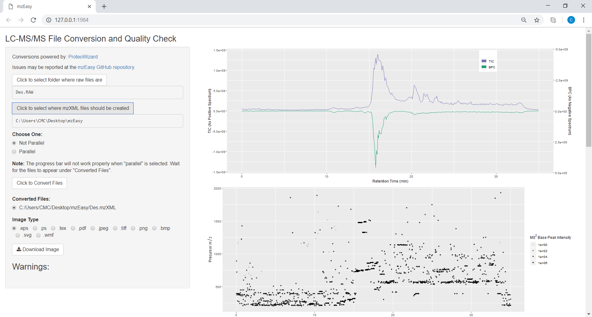
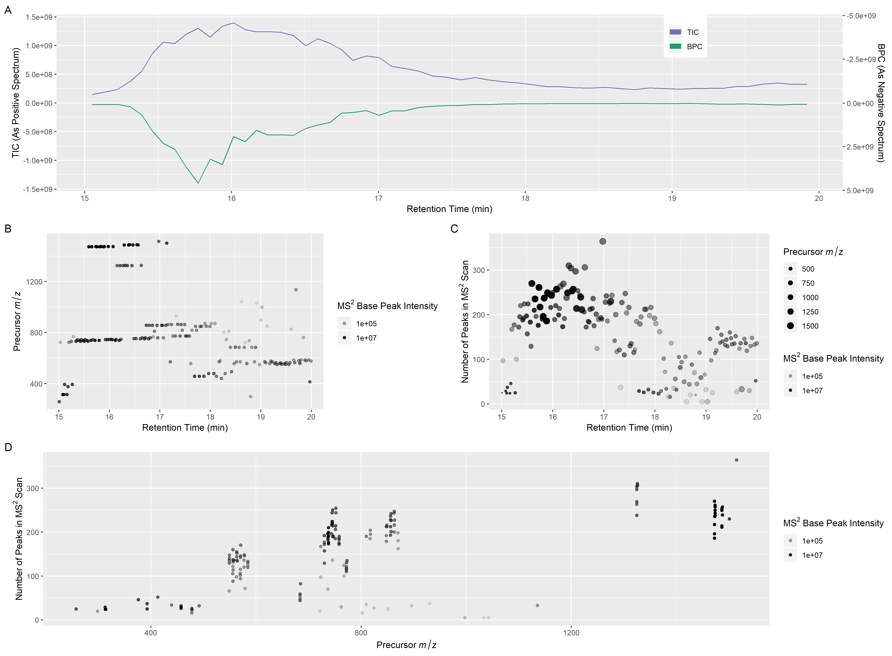

### Summary

An increase in access to liquid chromatography-mass spectrometry (LC-MS/MS) and advanced algorithms (often cloud-based) has led to a surge in users whose time is often better spent with advanced analyses than converting and evaluating their raw data.  However, conversion of raw spectra to open access formats and ensuring data is of good quality are necessary steps for proper use in later analyses. Unfortunately, users unfamiliar with conversion software often miss needed settings or are unsure how to proceeed, adding a barrier of entry to the use of more advanced analysis pipelines.

mzEasy provides a simple interface (Figure 1) with MSConvert [@Chambers2012] to convert raw MS files to the "mzXML" open access format [@Pedrioli2004]. As it utilizes Proteowizard's MSConvert, it is capable of converting raw data from such vendors as AB SCIEX, Agilent, Bruker, and ThermoFisher, and some limited Waters' data. The auto-generated overview plots allow for easy inspection of the converted files and feedback of whether the conversion was succesful, including the option to save graphs as a pre-assembled manuscript image (Figure 2). Importantly, mzEasy doesn't require (or have options for) adjusting/selecting any settings other than to select which image format to save plots. For more advanced processing options another software such as MZmine 2 [@Pluskal2010] should be used.

mzEasy is auto-configured to convert vendor files to mzXML with the basic settings required for analyses such as Global Natural Products Social molecular networking (GNPS) [@Wang2016] and is meant for anyone uneasy with using MSConvertGUI. 

It is also designed for users that want access to parallelized MSConvert and/or a simple way to generate quality control plots that are pre-arranged for easy publication/sharing.

**Features:**

 - Available for download as a Windows executable for easy installation. 
 - Interfaces with MSConvert for conversion of raw mass spectrometry data.
 - Provides the option to run conversion in parallel (# of cores minus one).
 - Creates graphs to assess, broadly, the quality of an LC-MS/MS file. Including:
     - Total Ion Current (TIC) and Base Peak Current (BIC)
     - Precursor *m/z* vs. retention time
     - Number of MS^2^ peaks per scan vs. retention time and precursor mass
     - Number of MS^2^ peaks per scan vs. precursor *m/z*
 - Allows export of graphs as a pre-assembled figure, in multiple image formats.
 - Automatic updates for future improvements.

**Availability:**

 - Download Windows installer: [chasemc.github.io/mzEasy](https://chasemc.github.io/mzEasy/)
 - Source code: [github.com/chasemc/mzEasy](https://github.com/chasemc/mzEasy) 

**Software Requirements:**

 - Windows operating system
 - ProteoWizard ([proteowizard.sourceforge.net](http://proteowizard.sourceforge.net))

mzEasy was written in R [@baseR2018] and utilizes Shiny [@shiny2018], RInno [@RInno2018], mzR [@Chambers2012], and ggplot2 [@gg2009].

{ width=75% }

{ width=75% }

# References

